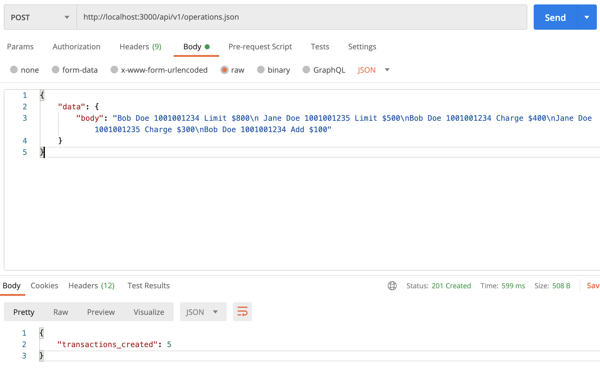
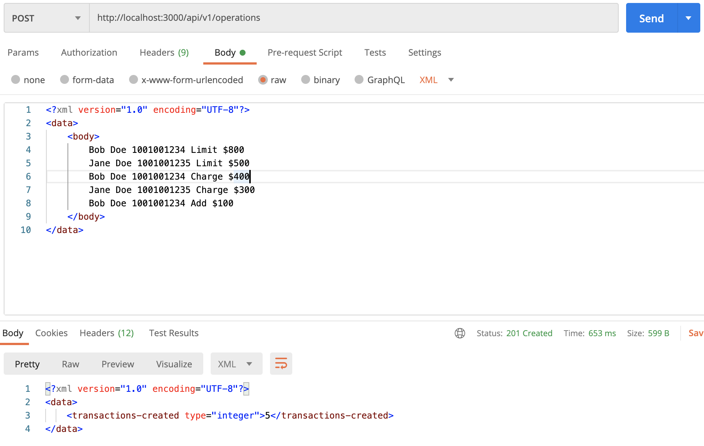
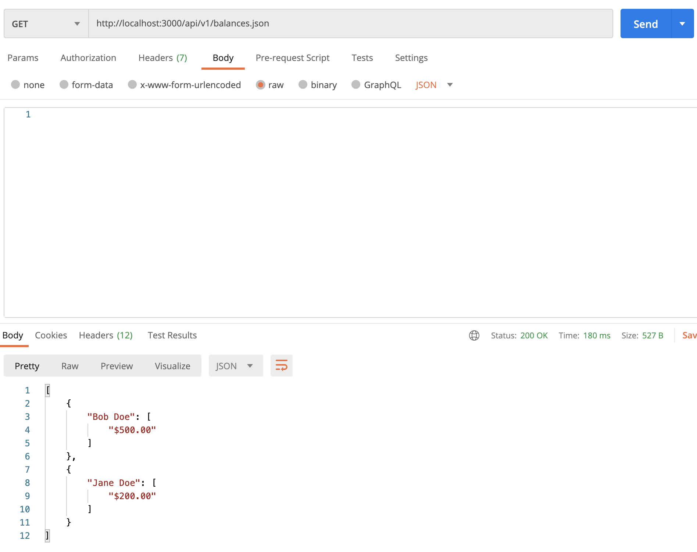
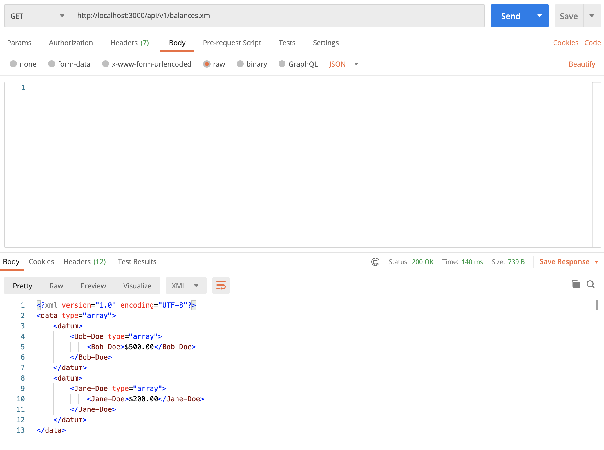

# README

Steps are necessary to get the application up and running:
Requirements:
* Ruby version: 2.5.8
* sqlite3 version: 3.28.0
* Database: 
- rails db:create
- rails db:migrate
* To run the test suite: rspec

#Task:

Imagine that you're writing software for a credit report.  Implement a program that will add new credit reports, process charges, credits against them, finally display summary information.

## Requirements
- Your program must accept input as a API
- On the API payload will in the format as follows:
  Bob Doe 1001001234 Limit $800
  Jane Doe 1001001235 Limit $500
  Bob Doe 1001001234 Charge $400
  Jane Doe 1001001235 Charge $300
  Bob Doe 1001001234 Add $100
- Your program has to be able to produce the following output given the previous example:
  Total debt:
    Bob Doe: $300 ??? Should probably be $500
    Jane Doe: $200

- Implement your solution using ruby, keep in mind you'll be asked to modify it on the interview.
- Include a README with an overview on your design decisions, and how to run your code. 

## Solution:

Models:
- Users have many Credit Reports
- Each credit report has many Transactions

There are Operations and Balance controllers:
- Operations controller - creates credit reports from the offered payload(json/xml)

- Balance controller - calculates users balances based on the transactions in credit reports

